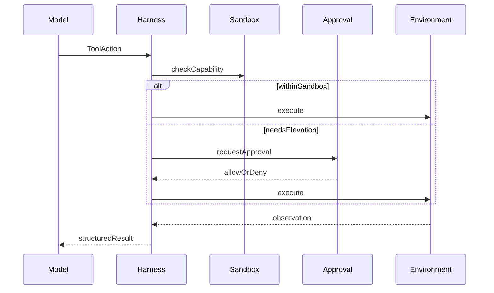
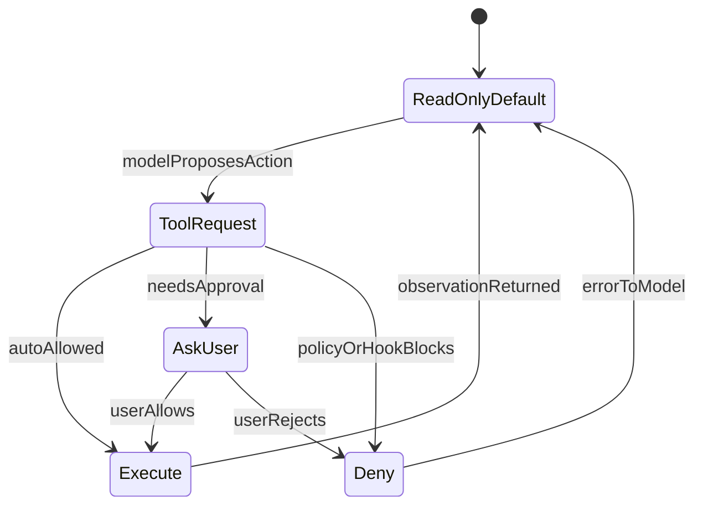
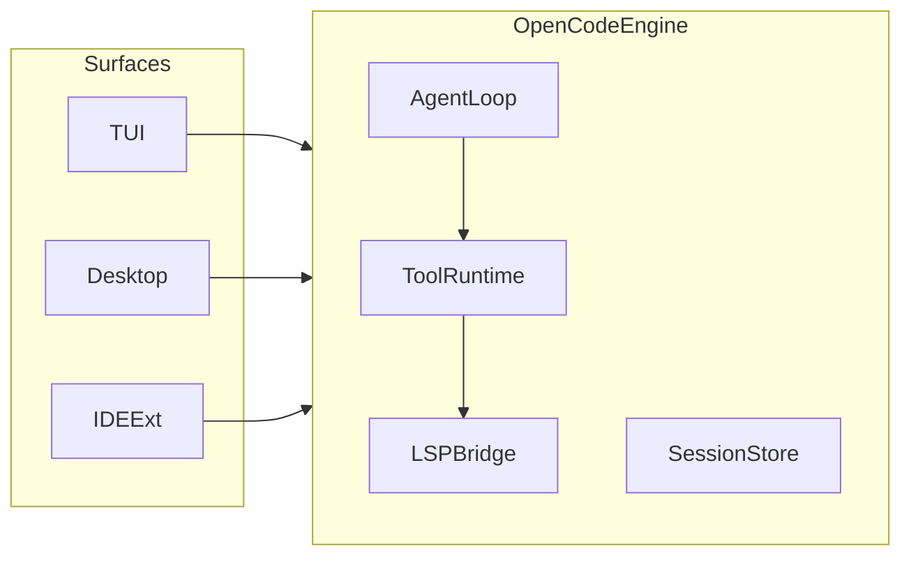
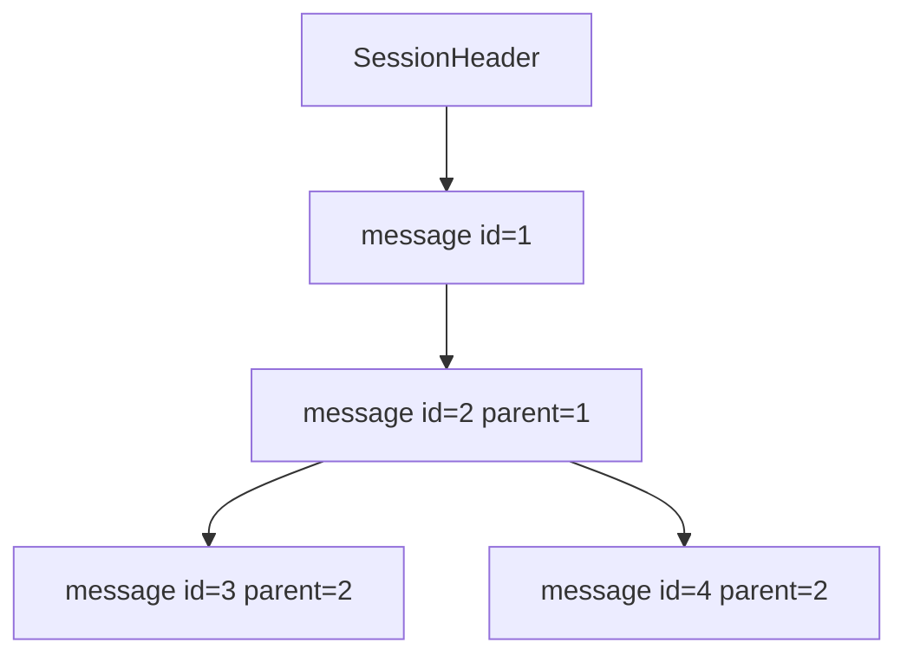
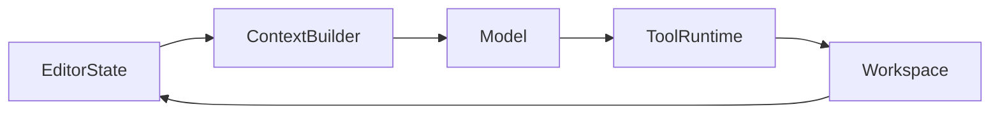
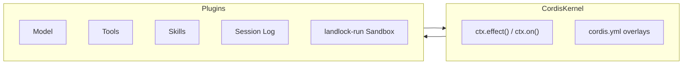
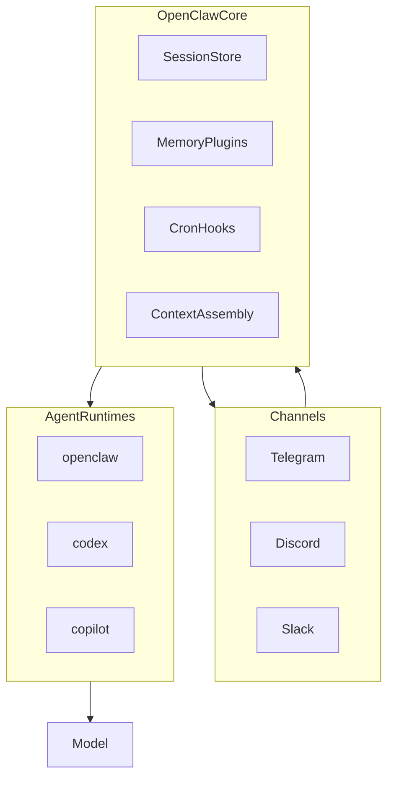
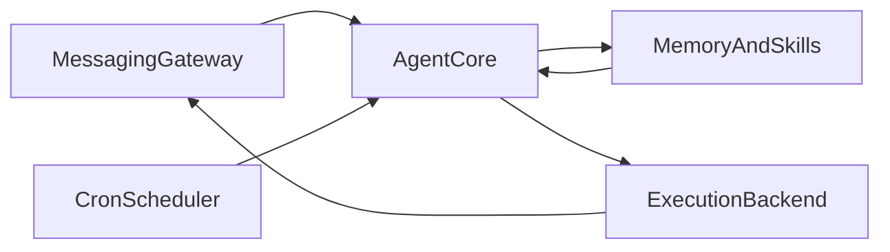

# 附录 D：Harness 产品案例横向对比

本附录是[第 1 章 1.6 节](ch1.md)"常见 Harness 设计分析"的完整案例材料。正文只保留五维度观察框架、一句话对比表和跨产品的设计张力归纳；这里展开每款产品的详细机制、取舍和一张示意图，供希望深入了解具体产品架构的读者阅读。

阅读这些案例时只关注维度，不把它当作排名或永久事实——产品能力会持续变化，细节请以各产品当前公开文档为准。同一模型接入不同 Harness，可见边界与失败模式也会显著不同。

下文先看编码向的六款（Codex、Claude Code、OpenCode、Pi、Cursor、DeepSeek Harness），再看常驻、多通道的两款（OpenClaw、Hermes）。

## Codex

OpenAI Codex 以 CLI 和云端 agent 为主入口，核心运行时公开部分以 Rust 实现。Codex CLI 把一次 coding 任务组织成有界工具循环：模型提出动作，运行时解析、约束并执行，再把观察写回上下文。

Codex 的安全设计值得单独看：**OS 级 sandbox 回答"技术上允许做什么"，approval policy 回答"这一轮是否允许升级权限"**。两者分开，失败时更容易判断是边界配置问题、审批策略问题，还是模型选错了工具。指令层则通过系统提示、`AGENTS.md` 分层规则和 skills 组织项目上下文。

从这个架构来看，强类型工具事件和统一协议有利于 trace、重放和测试——模型选错、策略拒绝、工具失败可以分开记录，而不必混成一条聊天日志。Codex 的取舍是：用较重的运行时换可审计性与生产默认值；代价是对内部实现的完全透明程度有限，且与 OpenAI 模型生态绑定更深。

## Claude Code

Claude Code 是终端侧的 coding agent。与 Codex 类似，它驱动文件、Shell、MCP 等工具循环；不同之处在于 Anthropic 把 **hooks、subagents、permissions、sessions、skills 和 plugins** 都收进同一 Agent 生命周期，而不是把它们当作外围脚本。

官方安全说明可见的行为是：**默认严格只读**；文件写入、可能改变系统状态的 Bash 操作，以及部分 MCP 调用，会请求用户批准。hooks 可以在工具执行前后插入强制询问或拒绝逻辑；subagent 则通过独立 prompt 和工具限制做上下文隔离。会话可恢复、可分叉；项目级指令由 `CLAUDE.md`、skills 和 memory 组织。

Claude Code 内部实现并不完全公开，上文只讨论文档中可复核的边界。它的设计重心是**用默认权限和生命周期扩展控制工作流**；推断上，这适合需要"先探索、再写入"的团队习惯，但也意味着理解系统行为需要同时读 permissions、hooks 和 sandbox 三层，而不是只看系统提示词。

## OpenCode

OpenCode 是 MIT 许可的开源 coding agent（anomalyco/opencode），入口包括终端 TUI、桌面应用和 IDE 扩展。架构上采用 client/server：多个 surface 可以连接同一 runtime engine；`opencode serve` 提供无头 OpenAPI 服务，便于异步或远程调用。

OpenCode 内置 **build** 与 **plan** 两种 agent 模式：build 具备完整写权限，plan 默认只读、执行 Bash 前需确认，适合先勘察仓库再动刀。工具层覆盖文件读写、搜索、Shell、Web 抓取，以及 **LSP 集成**——语言服务器提供的符号、诊断和补全会进入模型上下文，形成比纯文本 grep 更结构化的反馈。项目指令通过 `AGENTS.md` 初始化；扩展面包括 MCP、skills 和自定义 agent 定义。

OpenCode 的取舍是**模型中立与可自托管**：可接入多种 provider 或本地模型，OAuth 与 API Key 策略随版本变化，写作时不应写死。对本书的启示是：Harness 可以把"读诊断"和"读文件"一样做成一等反馈；plan/build 双模式则是 Policy 的产品化表达，而不是只在提示词里写"请先不要改文件"。

## Pi

Pi（badlogic/pi-mono）刻意保持**极小核心**：终端 TUI、print/JSON、RPC 和 SDK 四种运行模式，复杂行为由 Extensions、Skills、Prompt Templates 和 Themes 组合，而不是写死在主程序里。

Pi 的会话以 **JSONL** 持久化。每条记录有 `id` 和 `parentId`，形成树形历史：可以在原文件内分支（`/tree`）、fork 到新文件（`/fork`），而不必丢失完整轨迹。`AgentHarness` 层负责 session 持久化、操作锁和扩展写入顺序——agent 忙时，扩展发起的 session 写入会进入 pending queue，在 save point 与操作结算时 flush，避免 transcript 乱序。

Pi 非常适合作为**教学参考**：协议小、session 格式可读、扩展边界清楚。但必须强调：扩展代码运行在宿主权限下，**可扩展不等于已沙箱化**；安全边界更多由使用者配置，而不是运行时默认提供。本书借鉴的是"小核心 + 显式 session 事件"，而不是照搬其扩展信任模型。

## Cursor

Cursor 把 Harness 嵌进 IDE。模型并不自动知道用户打开了哪些文件、光标在哪一行、诊断面板报了什么错；**Context Builder** 从编辑器状态、codebase 索引、Rules、Skills 和对话历史中组装本轮输入。Agent 模式下，工具调用（读写文件、终端、搜索、MCP 等）同样经过运行时解析与审批，结果以 diff、终端输出或 linter 反馈的形式回到循环。

Cursor 是商业产品，此处只讨论可观察行为与公开文档中的机制，不做"比 CLI agent 更好"的判断。它的设计重心是**深集成编辑器上下文与审查 UX**：改动的可视化、部分操作的自动批准策略、以及 Rules/Skills 的项目级注入，都是 Harness 职责，而不是模型权重的一部分。失败定位时，要先问"必要上下文是否进入本轮输入"，再问"模型是否选错工具"。

## DeepSeek Harness

DeepSeek Harness（仓库内代号 `dsh`）是 DeepSeek 于 2026 年 8 月发布的开发者预览版智能体框架，MIT 协议开源，定位是"一切皆插件"的通用 Harness：模型适配、工具、Skill、会话、沙箱、存储、调度和 UI 全部实现为可插拔组件，运行在一个名为 Cordis 的插件内核之上。[^deepseek-harness]

入口是 CLI 与 Web UI 的组合（`npx @deepseek-ai/dsh web` 一行命令即可启动），任务域覆盖代码编写、文件编辑、Shell 执行、网页搜索、Skill 组合、目标规划与子智能体调度，和 Codex、Claude Code 等编码向产品的任务域接近，但把"可插拔"作为架构的首要目标，而不是先做好一体化默认体验再开放扩展点。

Cordis 内核把服务定义、提供者和消费者分开（capability-seam 模式）：新增能力通过 `ctx.effect()` / `ctx.on()` 注册，而不是直接修改 Agent Loop 核心代码；组合方式由配置文件（`cordis.yml`）声明，支持按条件叠加而不是写死分支。权限侧默认拒绝网络、IPC 和文件监听访问，通过 `landlock-run` 做主机级沙箱，需要显式升级才能放开；配置错误在加载期就会失败，而不是运行到一半才暴露。会话采用带版本号的追加式日志，要求"模型能看到的内容都必须被记录、可从事件重建"，并支持轨迹回放、分支和搜索。

与本书的对照关系很直接：DeepSeek Harness 把本书 Part V 才讨论的"扩展边界"（ch15 的 MCP/Skills/Hooks/Plugin）提前变成了核心架构假设——它不是在一个一体化 Harness 之外加插件，而是让 Harness 本身就是插件组合的结果。这个取舍换来的是组合自由度和可替换性，代价是核心边界（哪些插件可信、能力声明是否完整、加载期失败是否覆盖所有配置错误）必须从第一天就足够清楚，否则"一切皆插件"也意味着"哪里都可能被换成不可信实现"。发布仅几天，公开文档和生态验证还在快速变化，具体细节应以官方仓库当前文档为准。

## OpenClaw

OpenClaw（openclaw/openclaw）不是又一款 IDE 里的 coding copilot，而是**个人侧常驻 Agent 的 Gateway 型 Harness**：消息从 Telegram、Discord、Slack、WhatsApp 等通道进入，经会话、记忆、定时与工具层组织后，再交给某次 agent turn 执行。Pi 的 README 把 OpenClaw 列为 SDK 集成案例——二者可以组合，但 OpenClaw 本身关心的是「模型如何在多通道、长期运行里变成操作者」，而不是「如何改这一个 repo」。

OpenClaw 在配置里刻意拆开四层，避免把「模型名」和「执行后端」混为一谈：

| 层 | 含义 |
| --- | --- |
| Provider | 认证与模型目录，如 `anthropic`、`openai` |
| Model | 本轮选用的具体模型 ref |
| Agent runtime | 执行 prepared turn 的底层循环，如 `openclaw`、`codex`、`copilot` |
| Channel | 消息进出 Surface，如 Telegram、Discord |

**Harness** 在代码里指提供某一 agent runtime 的实现；一次 turn 里，它负责驱动模型输出、处理原生工具调用并把结果交回 OpenClaw。OpenClaw 仍拥有通道投递、会话镜像、记忆与 context 生命周期——即便 model loop 交给 Codex app-server，聊天通道也不会变成 Codex 的一部分。`agentRuntime.id` 可在 provider/model 级显式指定；显式选择失败时 **fail closed**，避免静默换 runtime 导致重复副作用。

与 Codex CLI 等同属编码向 Harness 相比，OpenClaw 把 **Channel、跨会话 Memory、Cron 与 runtime 路由** 放在更中心的位置；编码工具往往通过桥接或插件接入，而不是默认 Environment 就是 git worktree。失败定位时，除了「模型是否选对工具」，还要问「当前 channel 会话是否与 runtime 线程对齐」「记忆是否在本轮 context 里被 assemble」。

## Hermes

Hermes Agent（NousResearch/hermes-agent）同样**不以 IDE 为中心**，而是作为可自托管的 **daemon** 长期运行：Gateway 连接 Telegram、Discord、Slack、Signal 等十多种消息面，用户可以在手机上打断、续聊或下达新目标，而 Agent 在 VPS 或 Modal/Daytona 等后端继续工作。模型 provider 可切换（OpenRouter、Anthropic、OpenAI、本地 Ollama 等），Harness 价值主要在 provider 之外。

Hermes 的行为差异很大程度上来自 **Memory 与 Learning Loop**，而不是更好的代码补全：

- **跨会话记忆**：对话历史、用户偏好与项目笔记持久化；FTS5 索引支持跨 session 检索，必要时经 LLM 摘要再注入上下文。
- **程序性技能（Skills）**：重复出现的多步任务可被观察、蒸馏为 `SKILL.md`，下次以 slash command 或渐进披露方式加载；技能可在使用中自我修正。
- **Cron 与无人值守**：内置调度器用自然语言定义定时报告、备份、巡检，结果投递回任意已连接通道。
- **Subagent 与执行后端**：可 spawn 隔离子 agent；终端任务可在 local、Docker、SSH、Modal 等 backend 上运行，Harness 负责选择与隔离策略。

Hermes 与编码向 Harness 的对比很直观：Cursor 问「光标所在文件是否在本轮上下文里」；Hermes 问「三个月前你在 Telegram 里说的偏好是否仍被 recall」「昨晚 cron 跑完的结果是否已推送到 Slack」。验证也偏不同——coding agent 常靠测试与 linter；Hermes 更常靠**用户回复、投递确认与 skill 是否复用成功**。对本书的启示是：Harness 的 Loop Controller 与 Validation 必须随任务域定义；不能把「跑通单元测试」当作所有 Agent 的默认收敛条件。

[^deepseek-harness]: DeepSeek, [DeepSeek Harness developer preview](https://deepseek.com/harness/en/) 与 [deepseek-ai/deepseek-harness](https://github.com/deepseek-ai/deepseek-harness)，核验日期：2026-08-20。
