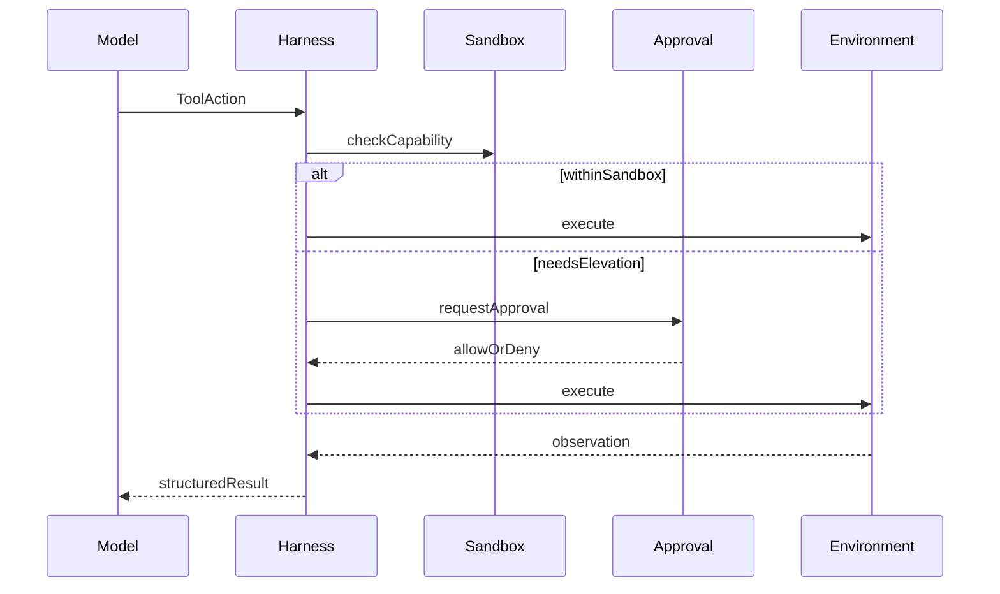
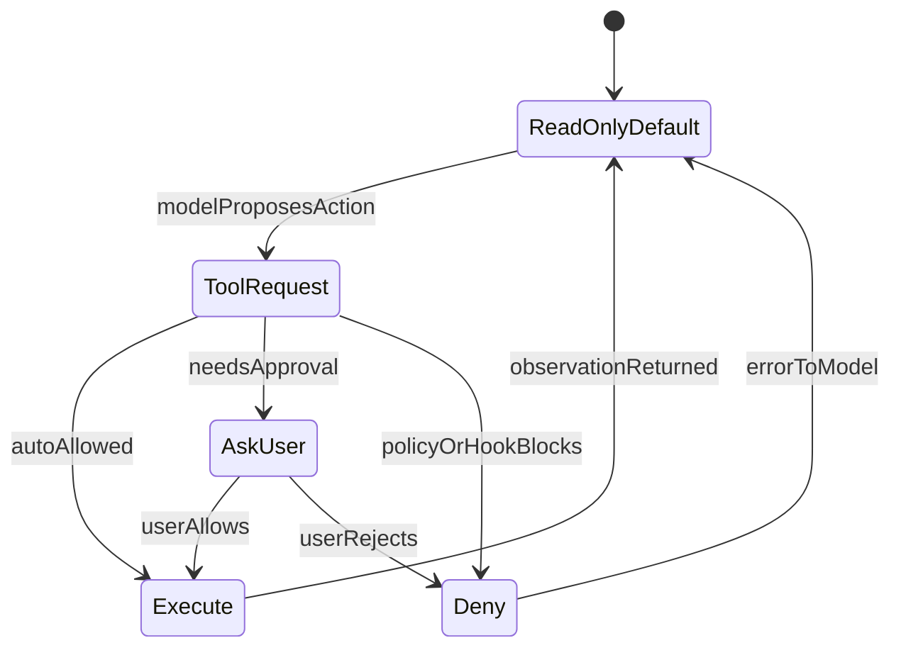
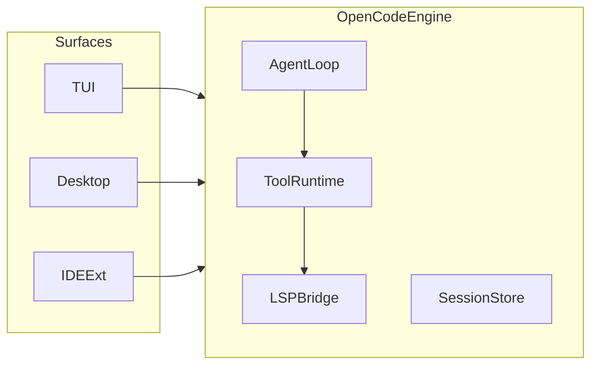
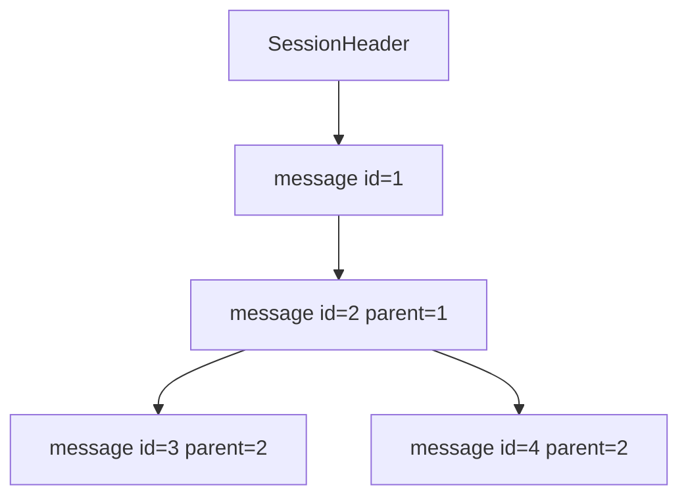
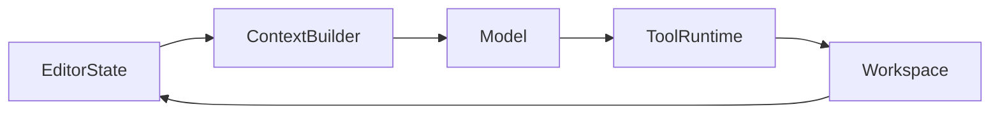
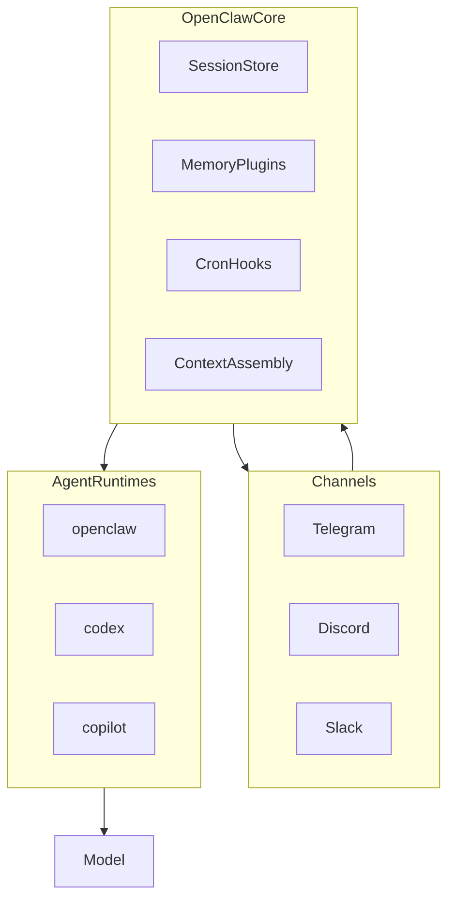
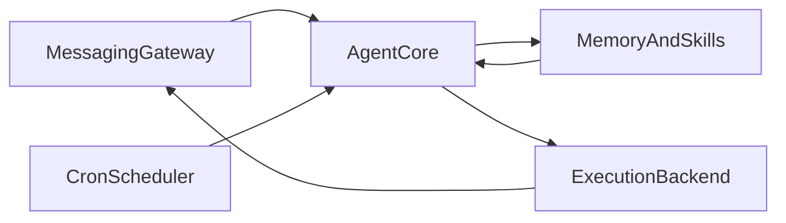

# 第 1 章：什么是 Harness

上一章把 Agent System 写成 `Model + Harness + Environment`。这个公式里，模型往往最受关注，Harness 却决定了模型能看见什么、能做什么，以及系统凭什么相信任务已经完成。下文先用常见产品对照 Harness 职责，再说明本书的最小选择。

## 1.1 Harness 的工程定义

Harness 是围绕模型构建的运行支撑层。它不负责替模型“思考”，而是把一次不确定的模型输出接入一个有状态、有权限、有验证的执行过程。

```text
                        ┌──────────────┐
                        │     User     │
                        └──────┬───────┘
                               │ Goal
                               ▼
┌──────────────────────────────────────────────────────┐
│                    Agent Harness                     │
│                                                      │
│  Context Builder   Tool Runtime   State / Memory     │
│  Permission        Policy         Validation         │
│  Observability     Recovery       Loop Controller    │
│                                                      │
└───────────────┬──────────────────────────┬───────────┘
                │ Model Input              │ Actions
                ▼                          ▼
        ┌──────────────┐           ┌──────────────┐
        │    Model     │           │ Environment  │
        └──────────────┘           └──────────────┘
```

提示词模板可以是 Harness 的一部分，但 Harness 远不只是一组提示词。它还必须处理程序世界里模型无法自行保证的事情：数据结构、I/O、权限、错误、预算、证据和终止。

## 1.2 Model、Harness 与 Environment 的边界

- **Model** 接收输入，返回文本或结构化动作候选。它不直接拥有宿主机权限。
- **Harness** 组织上下文、解释模型动作、实施策略、记录状态并驱动有界循环。
- **Environment** 是动作真正产生影响的地方，例如文件系统、终端、浏览器、数据库或远程 API。

一次工具调用因此不是“模型执行了命令”，而是：模型提出调用，Harness 检查调用，Environment 执行调用，Harness 再把结果作为观察交还给模型。

```text
ModelAction
    → PolicyDecision
    → ToolExecution
    → Observation
    → StateUpdate
```

这种拆分让失败可以被定位。模型选择错误、策略拒绝、工具运行失败和验证不通过是四类不同问题，不应该被压成一句“Agent 出错了”。

## 1.3 Harness 的核心职责


| 职责                  | 要回答的问题      | 最小输出             |
| ------------------- | ----------- | ---------------- |
| Context Builder     | 本轮模型应该看到什么  | 有序、受限的模型输入       |
| Tool Runtime        | 参数是否合法，怎样执行 | 结构化工具结果          |
| State / Session     | 任务进行到了哪里    | 可恢复或可重放的状态记录     |
| Permission / Policy | 这个动作是否允许执行  | Allow、Deny 或 Ask |
| Validation          | 环境是否真的满足目标  | 检查结果与失败原因        |
| Observability       | 系统为何做出这一步   | 事件、Trace 和证据     |
| Recovery            | 失败后怎样继续     | 重试、恢复、降级或终止决策    |
| Loop Controller     | 是否继续下一轮     | 明确的预算与停止原因       |


这些职责不意味着第一版就要实现八个复杂框架。先把输入、输出和所有者写清楚，通常比建立庞大的抽象层更重要。

## 1.4 为什么提示词不能代替系统边界

系统提示词可以告诉模型“不要删除文件”，却不能从操作系统层面阻止删除。它可以要求模型“先运行测试”，却不能证明测试进程真的启动、退出码为零，或测试覆盖了目标行为。

因此，安全与可靠性约束必须在模型之外执行：

- 路径规则和沙箱限制进程实际能够访问的资源；
- Policy 在工具执行前做出允许、拒绝或请求审批的决定；
- 超时和预算防止循环无限运行；
- Validator 根据环境状态判断任务是否完成；
- Event Log 保存可审计的行动与结果。

提示词仍然重要，但它适合表达目标、偏好和工作方法，不适合充当不可绕过的安全边界。

## 1.6 常见 Harness 设计分析

不同产品对工具、权限、会话和扩展的组合不同，产品能力也会持续变化。阅读对比时只关注维度，不把它当作排名或永久事实。同一模型接入不同 Harness，可见边界与失败模式也会显著不同。

先用五个维度建立观察框架：


| 维度  | 需要观察的问题                         |
| --- | ------------------------------- |
| 上下文 | 是否读取仓库指令、当前文件和历史状态              |
| 执行  | 工具是否有参数约束、审批和沙箱边界               |
| 状态  | 是否能恢复会话、重放事件和查看过程               |
| 扩展  | MCP、Skills、Hooks、Plugins 位于哪个边界 |
| 反馈  | 是否有测试、诊断、验证和人工升级                |


下文对照七款产品：五款**编码向** Harness（Codex、Claude Code、OpenCode、Pi、Cursor）与两款**常驻、多通道** Harness（OpenClaw、Hermes）。描述基于截至 2026 年初的公开文档与可观察行为；细节以各产品当前文档为准。

同一公式 `Agent = Model + Harness`，不同 Harness 会塑造不同的智能体行为：编码向产品默认假设 Environment 是仓库与终端，优化读写文件、跑测试、看 diff；常驻型产品则假设 Environment 是消息通道、日程与长期记忆，优化跨会话 recall、定时任务与从 Telegram 发来的打断。模型权重相同，行为轮廓也可以完全不同。

七者差异在于 Harness 把哪些职责做成一等模块：


| 产品          | 入口形态                 | 任务域     | Harness 重心（一句话）              |
| ----------- | -------------------- | ------- | ---------------------------- |
| Codex       | CLI / 云端 agent       | 软件工程    | 强类型运行时 + OS 沙箱与审批分离          |
| Claude Code | 终端 agent             | 软件工程    | 生命周期 hooks + 默认只读与权限升级      |
| OpenCode    | TUI / Desktop / IDE 扩展 | 软件工程    | 开源多模型 + LSP 反馈 + build/plan 模式 |
| Pi          | 终端 TUI / SDK / RPC    | 软件工程    | 极小核心 + 扩展组合 + JSONL 树形会话    |
| Cursor      | IDE 集成               | 软件工程    | 编辑器上下文 + Rules/Skills + 工具审批  |
| OpenClaw    | 多通道聊天 / Gateway      | 常驻运营    | 通道 + 记忆 + 调度 + 可插拔 agent runtime |
| Hermes      | 消息 Gateway / TUI / daemon | 常驻运营    | 跨会话记忆 + 技能学习环 + cron 投递      |


下面先看编码向的五款，再看 OpenClaw 与 Hermes 如何把 Harness 重心移出 IDE。

### Codex

OpenAI Codex 以 CLI 和云端 agent 为主入口，核心运行时公开部分以 Rust 实现。Codex CLI 把一次 coding 任务组织成有界工具循环：模型提出动作，运行时解析、约束并执行，再把观察写回上下文。

Codex 的安全设计值得单独看：**OS 级 sandbox 回答“技术上允许做什么”，approval policy 回答“这一轮是否允许升级权限”**。两者分开，失败时更容易判断是边界配置问题、审批策略问题，还是模型选错了工具。指令层则通过系统提示、`AGENTS.md` 分层规则和 skills 组织项目上下文。



从这个架构来看，强类型工具事件和统一协议有利于 trace、重放和测试——模型选错、策略拒绝、工具失败可以分开记录，而不必混成一条聊天日志。Codex 的取舍是：用较重的运行时换可审计性与生产默认值；代价是对内部实现的完全透明程度有限，且与 OpenAI 模型生态绑定更深。

### Claude Code

Claude Code 是终端侧的 coding agent。与 Codex 类似，它驱动文件、Shell、MCP 等工具循环；不同之处在于 Anthropic 把 **hooks、subagents、permissions、sessions、skills 和 plugins** 都收进同一 Agent 生命周期，而不是把它们当作外围脚本。

官方安全说明可见的行为是：**默认严格只读**；文件写入、可能改变系统状态的 Bash 操作，以及部分 MCP 调用，会请求用户批准。hooks 可以在工具执行前后插入强制询问或拒绝逻辑；subagent 则通过独立 prompt 和工具限制做上下文隔离。会话可恢复、可分叉；项目级指令由 `CLAUDE.md`、skills 和 memory 组织。



Claude Code 内部实现并不完全公开，上文只讨论文档中可复核的边界。它的设计重心是**用默认权限和生命周期扩展控制工作流**；推断上，这适合需要“先探索、再写入”的团队习惯，但也意味着理解系统行为需要同时读 permissions、hooks 和 sandbox 三层，而不是只看系统提示词。

### OpenCode

OpenCode 是 MIT 许可的开源 coding agent（anomalyco/opencode），入口包括终端 TUI、桌面应用和 IDE 扩展。架构上采用 client/server：多个 surface 可以连接同一 runtime engine；`opencode serve` 提供无头 OpenAPI 服务，便于异步或远程调用。

OpenCode 内置 **build** 与 **plan** 两种 agent 模式：build 具备完整写权限，plan 默认只读、执行 Bash 前需确认，适合先勘察仓库再动刀。工具层覆盖文件读写、搜索、Shell、Web 抓取，以及 **LSP 集成**——语言服务器提供的符号、诊断和补全会进入模型上下文，形成比纯文本 grep 更结构化的反馈。项目指令通过 `AGENTS.md` 初始化；扩展面包括 MCP、skills 和自定义 agent 定义。



OpenCode 的取舍是**模型中立与可自托管**：可接入多种 provider 或本地模型，OAuth 与 API Key 策略随版本变化，写作时不应写死。对本书的启示是：Harness 可以把“读诊断”和“读文件”一样做成一等反馈；plan/build 双模式则是 Policy 的产品化表达，而不是只在提示词里写“请先不要改文件”。

### Pi

Pi（badlogic/pi-mono）刻意保持**极小核心**：终端 TUI、print/JSON、RPC 和 SDK 四种运行模式，复杂行为由 Extensions、Skills、Prompt Templates 和 Themes 组合，而不是写死在主程序里。

Pi 的会话以 **JSONL** 持久化。每条记录有 `id` 和 `parentId`，形成树形历史：可以在原文件内分支（`/tree`）、fork 到新文件（`/fork`），而不必丢失完整轨迹。`AgentHarness` 层负责 session 持久化、操作锁和扩展写入顺序——agent 忙时，扩展发起的 session 写入会进入 pending queue，在 save point 与操作结算时 flush，避免 transcript 乱序。



Pi 非常适合作为**教学参考**：协议小、session 格式可读、扩展边界清楚。但必须强调：扩展代码运行在宿主权限下，**可扩展不等于已沙箱化**；安全边界更多由使用者配置，而不是运行时默认提供。本书借鉴的是“小核心 + 显式 session 事件”，而不是照搬其扩展信任模型。

### Cursor

Cursor 把 Harness 嵌进 IDE。模型并不自动知道用户打开了哪些文件、光标在哪一行、诊断面板报了什么错；**Context Builder** 从编辑器状态、codebase 索引、Rules、Skills 和对话历史中组装本轮输入。Agent 模式下，工具调用（读写文件、终端、搜索、MCP 等）同样经过运行时解析与审批，结果以 diff、终端输出或 linter 反馈的形式回到循环。



Cursor 是商业产品，此处只讨论可观察行为与公开文档中的机制，不做“比 CLI agent 更好”的判断。它的设计重心是**深集成编辑器上下文与审查 UX**：改动的可视化、部分操作的自动批准策略、以及 Rules/Skills 的项目级注入，都是 Harness 职责，而不是模型权重的一部分。失败定位时，要先问“必要上下文是否进入本轮输入”，再问“模型是否选错工具”。

### OpenClaw

OpenClaw（openclaw/openclaw）不是又一款 IDE 里的 coding copilot，而是**个人侧常驻 Agent 的 Gateway 型 Harness**：消息从 Telegram、Discord、Slack、WhatsApp 等通道进入，经会话、记忆、定时与工具层组织后，再交给某次 agent turn 执行。Pi 的 README 把 OpenClaw 列为 SDK 集成案例——二者可以组合，但 OpenClaw 本身关心的是「模型如何在多通道、长期运行里变成操作者」，而不是「如何改这一个 repo」。

OpenClaw 在配置里刻意拆开四层，避免把「模型名」和「执行后端」混为一谈：

| 层 | 含义 |
| --- | --- |
| Provider | 认证与模型目录，如 `anthropic`、`openai` |
| Model | 本轮选用的具体模型 ref |
| Agent runtime | 执行 prepared turn 的底层循环，如 `openclaw`、`codex`、`copilot` |
| Channel | 消息进出 Surface，如 Telegram、Discord |

**Harness** 在代码里指提供某一 agent runtime 的实现；一次 turn 里，它负责驱动模型输出、处理原生工具调用并把结果交回 OpenClaw。OpenClaw 仍拥有通道投递、会话镜像、记忆与 context 生命周期——即便 model loop 交给 Codex app-server，聊天通道也不会变成 Codex 的一部分。`agentRuntime.id` 可在 provider/model 级显式指定；显式选择失败时 **fail closed**，避免静默换 runtime 导致重复副作用。



与 Codex CLI 等同属编码向 Harness 相比，OpenClaw 把 **Channel、跨会话 Memory、Cron 与 runtime 路由** 放在更中心的位置；编码工具往往通过桥接或插件接入，而不是默认 Environment 就是 git worktree。失败定位时，除了「模型是否选对工具」，还要问「当前 channel 会话是否与 runtime 线程对齐」「记忆是否在本轮 context 里被 assemble」。

### Hermes

Hermes Agent（NousResearch/hermes-agent）同样**不以 IDE 为中心**，而是作为可自托管的 **daemon** 长期运行：Gateway 连接 Telegram、Discord、Slack、Signal 等十多种消息面，用户可以在手机上打断、续聊或下达新目标，而 Agent 在 VPS 或 Modal/Daytona 等后端继续工作。模型 provider 可切换（OpenRouter、Anthropic、OpenAI、本地 Ollama 等），Harness 价值主要在 provider 之外。

Hermes 的行为差异很大程度上来自 **Memory 与 Learning Loop**，而不是更好的代码补全：

- **跨会话记忆**：对话历史、用户偏好与项目笔记持久化；FTS5 索引支持跨 session 检索，必要时经 LLM 摘要再注入上下文。
- **程序性技能（Skills）**：重复出现的多步任务可被观察、蒸馏为 `SKILL.md`，下次以 slash command 或渐进披露方式加载；技能可在使用中自我修正。
- **Cron 与无人值守**：内置调度器用自然语言定义定时报告、备份、巡检，结果投递回任意已连接通道。
- **Subagent 与执行后端**：可 spawn 隔离子 agent；终端任务可在 local、Docker、SSH、Modal 等 backend 上运行，Harness 负责选择与隔离策略。



Hermes 与编码向 Harness 的对比很直观：Cursor 问「光标所在文件是否在本轮上下文里」；Hermes 问「三个月前你在 Telegram 里说的偏好是否仍被 recall」「昨晚 cron 跑完的结果是否已推送到 Slack」。验证也偏不同——coding agent 常靠测试与 linter；Hermes 更常靠**用户回复、投递确认与 skill 是否复用成功**。对本书的启示是：Harness 的 Loop Controller 与 Validation 必须随任务域定义；不能把「跑通单元测试」当作所有 Agent 的默认收敛条件。

### 横向归纳：Harness 设计张力

七款产品并不指向同一最优解，而是占住几种不同的张力：

**编码 vs 常驻运营。** Codex、Claude Code、OpenCode、Pi、Cursor 默认 Environment 是仓库与开发工具链；OpenClaw 与 Hermes 默认 Environment 是消息通道、日程与跨会话用户状态。同一模型在前者里像「工程师」，在后者里像「值班操作员」——差别主要在 Harness 装配的上下文与反馈，而非参数规模。

**集成深度 vs 可移植性。** Cursor 把 Harness 绑在 IDE 内，换来打开文件、诊断和 diff 的原生上下文；Pi 和 OpenCode 更偏终端或 SDK，便于嵌入脚本、CI 或自建 UI；OpenClaw 与 Hermes 则把可移植性放在 Gateway 与自托管 daemon 上。没有绝对高下，只有任务是否依赖编辑器态或是否要求 7×24 在线。

**默认安全 vs 组合自由。** Claude Code 和 Codex 内置较明确的 permission 与 sandbox 默认值；Pi 把能力交给 Extensions 组合，灵活但边界由使用者承担。OpenCode 用 plan/build 模式在二者之间切分只读与写入阶段。Hermes 提供多种 execution backend，隔离强度随 backend 变化，不能默认等于 OS 级沙箱。

**厂商绑定 vs 模型中立。** Codex、Claude Code、Cursor 各自绑定模型与账号生态；OpenCode、Pi、OpenClaw 与 Hermes 更强调多 provider 或可插拔 runtime。Harness 设计因此也包含「模型路由放在哪一层、runtime 切换是否 fail closed」的问题。

读产品时应问「哪一层是 Harness 负责的」，而不是「哪个模型更强」。七者都证明：Agent 行为轮廓，大量来自运行时如何把上下文、工具、权限、记忆与反馈接进循环——**换 Harness，比换模型更常改变智能体「像什么」**。

上述产品可以很重、很开放，或 IDE 原生；本书的目标不同——先做一个**可测试、可解释、默认确定性**的最小闭环，而不是复刻任何一家。下一节说明这一选择的具体原则。

## 1.7 本书选择的最小 Harness

本书选择以下原则：

1. **小而完整**：先形成一个能结束、能失败、能被测试的闭环。
2. **边界显式**：模型、策略、工具、验证和状态各自返回结构化结果。
3. **默认确定性**：默认测试不访问真实网络，不依赖 API Key。
4. **安全在模型之外实施**：不把提示词当作权限控制。
5. **正文追溯到源码**：核心 Python 片段来自可测试示例，Rust 实现通过索引引用。
6. **保持通用**：通用 Harness 不依赖 Forge Studio 或其他产品领域类型。

最小闭环可以表示为：

```text
Goal
  → Build Context
  → Model Action
  → Policy Check
  → Tool Execution
  → Observation
  → Validation
  → Continue or Stop
```

“最小”意味着暂不加入用不到的抽象；“完整”意味着不能省略失败路径和停止条件。本书也不复刻任何现有产品，不把 Forge Studio 的领域模型放进通用核心。

## 1.8 本章小结

大语言模型提供生成和推理能力，Harness 决定这种能力如何进入真实环境。下一章先退回到最小起点：不调用工具、不驱动循环，只完成一次真实但有安全边界的模型请求，并观察它为什么还不是 Agent。

## 1.9 边界画出来以后，系统并没有自动变强

本章开始时，“模型会回答”很容易被误读成“系统能完成任务”；现在至少可以把模型、Harness 和 Environment 的责任分开。收益是故障可以被定位：解析失败属于协议边界，工具失败属于 Runtime，越权属于 Policy，结果不满足目标属于 Validation。后面每加入一个模块，读者都能问它究竟接住了哪一种失败。

当前状态仍应保持克制：M0–M2 的实现和测试已经存在，但本章介绍的完整职责表不是一个已经交付的生产 Harness。P0 组合拥有确定性 Runner、Policy、Tool、Validation 和事件，但它是内存内参考实现。整体成熟度属于 **Experimental**：边界语言可用于教学和设计评审，跨模块的生产运行条件尚未具备。

边界也带来了代价。抽象层越多，数据转换和责任错位的机会越多；如果把“模型提出了动作”误当成“Policy 已批准”，系统就会在文字上有安全边界、在执行上没有安全边界。AI 的非确定性还会让同一职责边界收到不同形状的候选，因此每个边界都必须有结构化失败和离线测试，不能只靠示例中的成功路径。

本章有意留下的技术债，是暂时不实现完整权限、状态和验证框架。现在先把职责说清楚，下一章再用一次最小模型调用证明：即使 Transport 和解析都正确，模型仍然看不到环境，也不能凭空完成 `hello.txt` 的读取。
