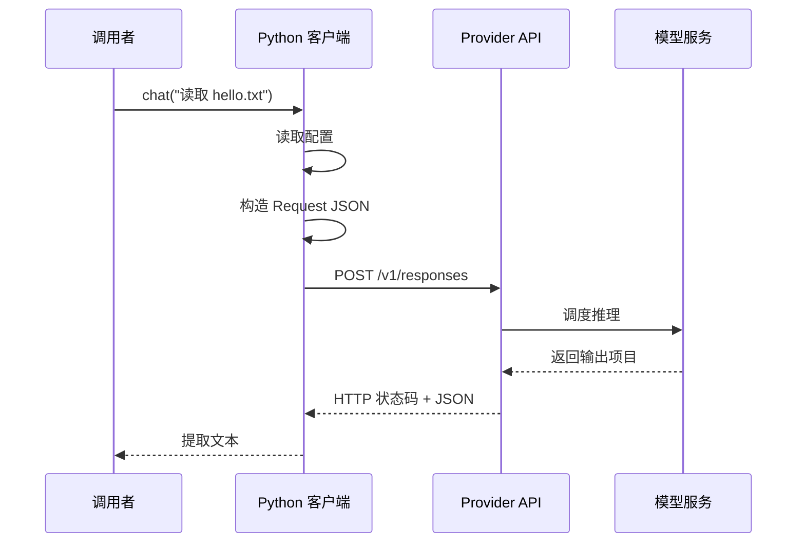

# 第 2 章：第一次模型调用

**状态：已实现并验证。** 本章只完成一次非流式模型请求，不执行工具、不维护会话，也不验证任务结果。

上一章说 Harness 要连接模型与环境。现在先把起点固定下来：模型只能看到本次输入，不能自动看到本地文件。

## 2.1 连续案例：模型能不能读取 `hello.txt`

我们从同一个问题开始：

```text
请读取工作区 hello.txt 的第一行并告诉我内容；
如果无法访问文件，不要猜测。
```

模型收到的只是这段文本。它不知道当前目录有什么文件，也不知道文件内容是否为 `hello workspace`。如果我们把它无法访问的文件描述成事实，得到的可能只是猜测。

```text
output = model(input, parameters, sampling)
```

模型可以生成回答，但它不会自动获得：

- 本地磁盘上的文件列表；
- 上一次工具调用是否成功；
- 当前任务已经执行到哪一步；
- 另一个程序刚刚写入的内容。

只有 Harness 把这些信息放进输入，模型才有机会使用它们。

## 2.2 一次请求—响应的最小流程

先用伪代码固定职责：

```python
config = load_config()
request = build_request(config, prompt)
response = send_http_request(request, config)
return parse_response(response)
```

配置、请求构造、网络传输和响应解析彼此独立。后续更换 Provider 或增加工具时，可以替换边界适配器，而不必让每一层都知道 Provider JSON。



HTTP 库会替我们处理 DNS、TCP 和 TLS；本章只要求理解 URL、Header、JSON Body、状态码和响应解析。

## 2.3 先固定请求和响应契约

最小请求可以写成：

```json
{
  "model": "由 OPENAI_MODEL 提供",
  "input": "请读取工作区 hello.txt 的第一行，并告诉我内容。"
}
```

响应不是一个永远固定的数组下标。`output` 可能包含多个项目，程序应遍历内容，只提取非空的 `output_text`。如果只有 reasoning、拒答或未知项目，本章返回明确的响应格式错误，而不是假装得到了文件内容。

Responses API 与 Chat Completions 的字段不同：前者使用 `input` 和 `output`，后者使用 `messages` 和 `choices`。这正是下一章要建立统一协议的原因。[^responses-api]

## 2.4 Python 实现：配置、传输、解析

下面的片段来自 `examples/python/m0-model-call/chat_once.py`，不是独立复制的示例。

### 构造请求

```python
{{#include ../../examples/python/m0-model-call/chat_once.py:m0-build-request}}
```

`build_request` 是纯函数，因此不需要网络就能测试。真实请求的 API Key 只来自环境变量，不进入源码、fixture 或诊断输出。

### 提取文本

```python
{{#include ../../examples/python/m0-model-call/chat_once.py:m0-extract-output}}
```

这里遍历输出项目，而不是使用 `body["output"][0]`。它能处理 reasoning 出现在文本之前，也能把多个文本块按顺序合并。

### 编排一次调用

```python
{{#include ../../examples/python/m0-model-call/chat_once.py:m0-chat-once}}
```

这一层把配置、请求、传输和解析串起来；传入 Fake Transport 时，整个流程可以离线运行。

连续案例在测试中仍然只是一个普通 prompt：

```python
{{#include ../../examples/python/m0-model-call/test_chat_once.py:m0-reading-case}}
```

## 2.5 失败路径先于真实请求

默认测试不访问真实网络，因为真实请求需要 API Key、网络和费用控制。至少应覆盖：

| 场景 | 期望结果 |
|---|---|
| 缺少 API Key 或模型名 | 发请求前返回配置错误 |
| HTTP 401、429、500 | 返回状态错误，不回显响应正文 |
| 非法 JSON | 返回响应格式错误 |
| 缺少 `output` 或 `output_text` | 明确失败，不伪造文本 |
| reasoning 在文本之前 | 仍然提取可识别文本 |
| 多个 `output_text` | 按响应顺序合并 |

验证命令：

```bash
python3 -m py_compile examples/python/m0-model-call/chat_once.py
python3 -m unittest discover \
  -s examples/python/m0-model-call \
  -p 'test_*.py'
```

只有手动运行下面的命令才会访问真实服务：

```bash
export OPENAI_API_KEY="your_api_key_here"
export OPENAI_MODEL="a-model-available-to-your-account"
python3 examples/python/m0-model-call/chat_once.py
```

模型目录和账户权限会变化，示例使用环境变量而不是写死模型名。缺少配置时程序应安全失败。

## 2.6 为什么这还不是 Agent

这次调用即使成功，也不能证明：

- 模型真的读取了 `hello.txt`；
- 模型执行了工具；
- 任务已经完成；
- 结果已经通过验证。

本章完成的是模型调用基础设施。下一章会定义 `Message`、`ContentBlock` 和 `ToolDefinition`，让模型可以提出一个结构化的 `read` 候选；但候选仍然不会自动执行。

实现路径和 Rust 对照见[实现索引](implementations.md)。

[^responses-api]: OpenAI, [Responses API reference](https://platform.openai.com/docs/api-reference/responses)，核验日期：2026-08-08。具体字段以当前官方文档为准。
