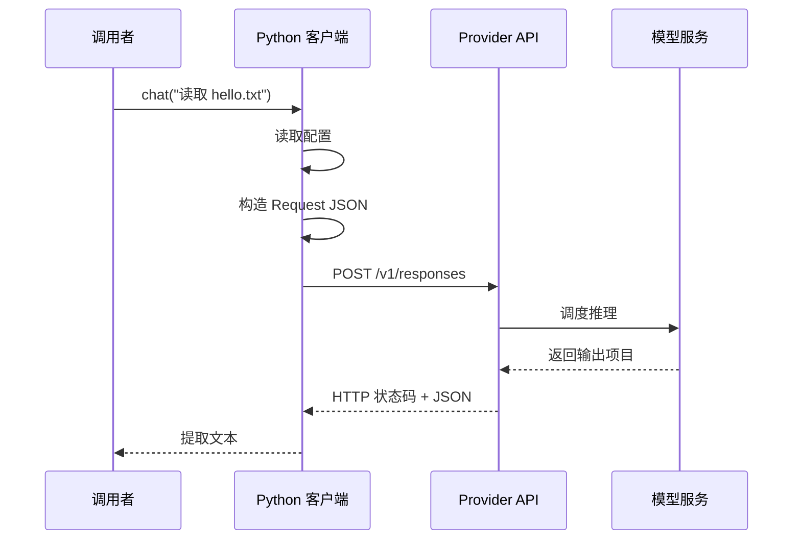
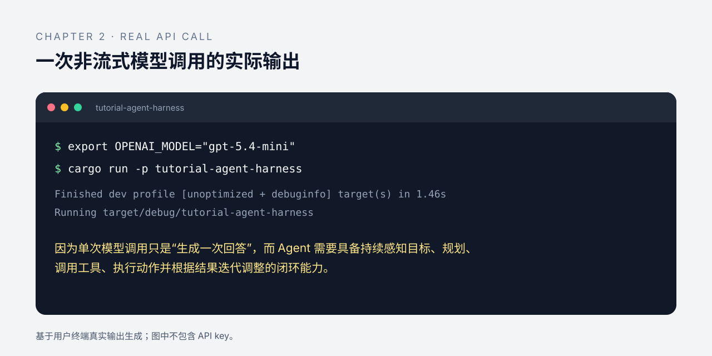

# 第 2 章：第一次模型调用

上一章说 Harness 连接模型与环境。本章从一次最基本的模型调用开始，按"理解模型调用 → 确定契约 → 实现解析 → 覆盖失败路径"四步推进，逐步构建起最小可用的 Harness。整个过程不执行工具、不维护会话——完成一次请求—响应，但还不是 Agent。

## 2.1 大模型的本质：无状态随机函数

大模型的调用可以抽象成最简单的形式：

```text
output = model(input)
```

一次调用接收输入、返回输出，不携带记忆，也没有内部状态。

实际使用中，为了提升用户体验，我们往往还需要设计模型记忆、模型参数等，因此可以采用下列模型：

```text
output = model(user_input, parameters, sampling, ...)
```

参数与记忆让同一模型的输出可以匹配不同场景，但也让每次调用的可复现性下降——Harness 的价值之一，就是把这类可变因素显式地管理起来。

鉴于本章暂时只讨论模型调用，因此我们只需要使用第一个等式：`output = model(input)`。

我们从同一个问题开始：

```text
请读取工作区 hello.txt 的第一行并告诉我内容；
如果无法访问文件，不要猜测。
```

模型收到的只是这段文本。它不知道当前目录有什么文件，也不知道文件内容是否为 `hello workspace`。如果我们把它无法访问的文件描述成事实，得到的可能只是猜测。即使带上 `parameters` 和 `sampling`，模型依然看不到这些环境状态。

模型可以生成回答，但它不会自动获得：

- 本地磁盘上的文件列表；
- 上一次工具调用是否成功；
- 当前任务已经执行到哪一步；
- 另一个程序刚刚写入的内容。

只有 Harness 把这些信息放进输入，模型才有机会使用它们。

## 2.2 一次请求—响应的最小流程

一次最小调用涉及四个角色：调用者、客户端、Provider API 和模型服务。




如果你有一定的网络基础知识，可以尝试写出下面的伪代码：

```python
config = load_config()
request = build_request(config, prompt)
response = send_http_request(request, config)
return parse_response(response)
```

配置、请求构造、网络传输和响应解析彼此独立。后续更换 Provider 或增加工具时，可以替换边界适配器，而不必让每一层都知道 Provider JSON。

HTTP 库会替我们处理 DNS、TCP 和 TLS；本章只要求理解 URL、Header、JSON Body、状态码和响应解析。

## 2.3 确定请求和响应契约

最小请求可以写成：

```json
{
  "model": "由 OPENAI_MODEL 提供",
  "input": "请读取工作区 hello.txt 的第一行，并告诉我内容。"
}
```

响应不是一个永远固定的数组下标。`output` 可能包含多个项目，程序应遍历内容，只提取非空的 `output_text`。如果只有 reasoning、拒答或未知项目，本章返回明确的响应格式错误，而不是假装得到了文件内容。

Responses API 与 Chat Completions 的字段不同：前者使用 `input` 和 `output`，后者使用 `messages` 和 `choices`。这正是下一章要建立统一协议的原因。[^responses-api]

## 2.4 Python 实现：配置、传输、解析

下面的片段来自 `examples/python/m0-model-call/chat_once.py`，不是独立复制的示例。它把配置、传输与解析放在同一模块，通过注入接口分离，因此默认可以离线运行。

### 构造请求

```python
{{#include ../../examples/python/m0-model-call/chat_once.py:m0-build-request}}
```

`build_request` 是纯函数，因此不需要网络就能测试。真实请求的 API Key 只来自环境变量，不进入源码、fixture 或诊断输出。

### 提取文本

```python
{{#include ../../examples/python/m0-model-call/chat_once.py:m0-extract-output}}
```

这里遍历输出项目，而不是使用 `body["output"][0]`。它能处理 reasoning 出现在文本之前，也能把多个文本块按顺序合并。

### 编排一次调用

```python
{{#include ../../examples/python/m0-model-call/chat_once.py:m0-chat-once}}
```

这一层把配置、请求、传输和解析串起来；传入 Fake Transport 时，整个流程可以离线运行。

连续案例在测试中仍然只是一个普通 prompt：

```python
{{#include ../../examples/python/m0-model-call/test_chat_once.py:m0-reading-case}}
```


## 2.5 失败路径先于真实请求

默认测试不访问真实网络，因为真实请求需要 API Key、网络和费用控制。至少应覆盖：


| 场景                          | 期望结果           |
| --------------------------- | -------------- |
| 缺少 API Key 或模型名             | 发请求前返回配置错误     |
| HTTP 401、429、500            | 返回状态错误，不回显响应正文 |
| 非法 JSON                     | 返回响应格式错误       |
| 缺少 `output` 或 `output_text` | 明确失败，不伪造文本     |
| reasoning 在文本之前             | 仍然提取可识别文本      |
| 多个 `output_text`            | 按响应顺序合并        |


验证命令：

```bash
python3.11 -m py_compile examples/python/m0-model-call/chat_once.py
python3.11 -m unittest discover \
  -s examples/python/m0-model-call \
  -p 'test_*.py'
```

只有手动运行下面的命令才会访问真实服务：

```bash
export OPENAI_API_KEY="your_api_key_here"
export OPENAI_MODEL="a-model-available-to-your-account"
python3.11 examples/python/m0-model-call/chat_once.py
```

模型目录和账户权限会变化，示例使用环境变量而不是写死模型名。缺少配置时程序应安全失败。

## 2.6 为什么这还不是 Agent

这次调用即使成功，也不能证明：

- 模型真的读取了 `hello.txt`；
- 模型执行了工具；
- 任务已经完成；
- 结果已经通过验证。

本章完成的是模型调用基础设施。下一章会定义 `Message`、`ContentBlock` 和 `ToolDefinition`，让模型可以提出一个结构化的 `read` 候选；但候选仍然不会自动执行。

实现路径和 Rust 对照见[实现索引](implementations.md)。

[^responses-api]: OpenAI, [Responses API reference](https://platform.openai.com/docs/api-reference/responses)，核验日期：2026-08-08。具体字段以当前官方文档为准。

## 2.7 一次调用换来了什么，又没有换来什么

在本章之前，Harness 只有概念边界；现在有了配置、请求构造、Transport、响应解析和可注入的 Fake Transport。真正的收益不是“能发 HTTP”，而是 Provider 访问被压缩在一个可替换边界内：测试可以构造成功、超时、HTTP 错误和坏 JSON，而不需要网络或真实 API Key；上层也能区分“请求没发出去”和“响应无法解释”。

代价同样具体。非流式请求会等待完整响应，Transport 超时仍可能留下未知的远端状态；解析器只认识当前约定的响应形状，Provider 字段变化会在边界处失败。模型本身还可能产生事实错误或自信的错误文本，单次调用没有工具、状态和独立验证，因此不能把 `200 OK` 当成任务完成证据。

| 当前能力 | 状态 |
| --- | --- |
| Python/Rust M0 请求与解析 | 已实现并验证 |
| 默认测试不联网、不读取真实密钥 | 已实现并验证 |
| 重试、fallback、streaming、成本控制 | 设计骨架/尚未实现 |
| Agent Loop 与环境执行 | 尚未由本章实现 |

当前成熟度是 **Prototype**：它足以作为后续协议和工具章节的输入，也有失败路径测试；但 Provider 兼容性、重试语义和运行观测还没有形成稳定承诺。这里有意留下的技术债是只支持一次、非流式、边界清楚的请求。下一章的必要性正由这个限制产生：如果上层继续直接读取 Provider JSON，第二个 Provider 一加入，解析逻辑就会扩散到整个 Loop。

## 2.8 Rust 累计工程

本章的 Rust 代码位于 `tutorial/agent-harness/`。它是从这里开始逐章累积的教学工程：`Config` 负责环境变量和边界校验，`build_request` 生成当前 Provider 的最小 JSON，`Transport` 把 HTTP 与可控的 Fake Transport 隔开，解析器只在 Provider 边界内读取 `output_text`。

可以先运行离线测试：

```bash
cargo test -p tutorial-agent-harness --offline
```

手动真实请求仍需要用户自己提供配置：

```bash
export OPENAI_API_KEY="your_api_key_here"
export OPENAI_MODEL="a-model-available-to-your-account"
cargo run -p tutorial-agent-harness
```

默认测试不会读取真实密钥或访问网络。Rust 工程与 Python 原型共享 M0 的行为边界，但本章不把 Provider JSON 提前提升为统一协议；这正是下一章要解决的问题。

## 2.9 一次真实调用的效果

在本地配置 `OPENAI_API_KEY` 和 `OPENAI_MODEL` 后，累计工程可以发起一次真实的非流式请求。下面的效果图基于一次真实终端输出生成，图中没有保存或展示 API Key；它证明的是这次请求返回了模型文本，不证明模型访问了工作区或任务已经完成。



本次示例使用的模型是 `gpt-5.4-mini`。模型目录和账户权限会变化，读者应以自己账户当前可用的模型 ID 为准。
