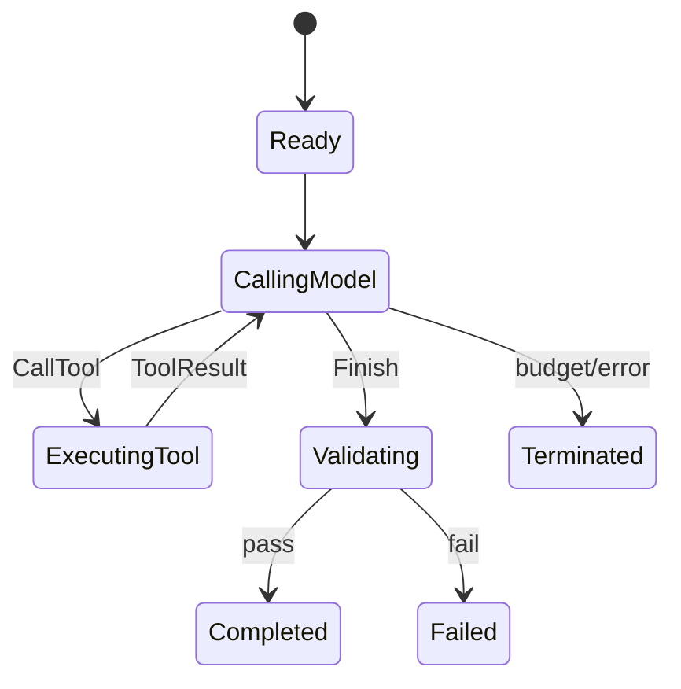

# 第 5 章：第一个 Agent Loop

**状态：已实现并验证。** 本章冻结的 M3 问题、代码增量和验证场景现在有两份独立实现：`examples/python/m3-agent-loop/`（Python-first）与 `examples/rust/m3-agent-loop/`（Rust 对照），测试矩阵见 [`evals/m3-test-matrix.md`](../../evals/m3-test-matrix.md)。当前 P0 的确定性 Runner 仍只是参考切片，不是 M3 本身——两者的边界见 §5.6。

第 4 章的 `one_step` 很诚实：第一次模型调用提出工具，Runtime 执行一次，第二次模型调用给出文本。它也留下了一个明显问题：如果第二次响应又提出工具，我们只能报错。模型—工具—模型还没有成为循环。

## 5.1 先把问题说具体

假设模型在第二次响应中再次请求 `read`。第 4 章的 `one_step` 会把它当成错误，因为它只预留了“第一次请求工具、第二次返回文本”这条路径。问题不是再写一个 `if`，而是下一轮必须重新完成同一组动作：构造输入、询问模型、检查动作、执行工具、把观察放回历史。

因此，本章的工程增量可以先写成一句话：

```text
Before: 最多完成一次工具调用。
After: 允许多轮工具调用，但在明确预算和停止原因下结束。
```

完成 M3 后，读者应能用脚本化模型验证这条因果链。下面先用已经可运行的 P0 参考切片建立直觉，再把 M3 自己的最小实现（Python 与 Rust 各一份，见 §5.6）过一遍。

## 5.2 从手动两次调用到循环

最直接的改法是把固定的两次调用改成 `loop`：

```text
while budget remains:
  input = build_context(history)
  action = model.next_action(input)
  if action is Finish: validate and stop
  if action is CallTool: policy → execute → append result
stop with BudgetExhausted
```

这里的关键不是 `while` 关键字，而是每次迭代都必须有明确的输入、动作、观察和下一步条件。工具失败也是观察，不应被异常直接吞掉。

```rust
loop {
    let input = context.build(&request, &events, &limits)?;
    let action = model.next_action(input)?;
    match action {
        ModelAction::CallTool(call) => {
            policy.check(&call)?;
            let result = tools.execute(call)?;
            events.push(Event::ToolFinished(result));
        }
        ModelAction::Finish { output } => return validate(output, events),
    }
}
```

这段代码仍是教学草稿。它先回答控制流问题，不提前解决持久化、并行工具或隐藏重试。

## 5.3 运行当前可验证的参考切片

M3 现在有独立实现（见 §5.6），但下面先用仓库里已经可运行的 P0 demo 建立直觉——它把同一条循环路径接成一个确定性组合，使用脚本化模型先调用 `echo`，再返回最终文本：

```text
ScriptedMockModel
  1. CallTool(echo, value=7)
  2. Finish("echo completed")
```

运行：

```bash
cargo run -p p0-demo
```

当前验证输出为：

```text
outcome=Completed { ... }
event_count=11
evidence_count=1
```

这里的 `11` 不是性能指标，而是这条确定性路径实际记录的事件数。若要看顺序，运行集成测试：

```bash
cargo test -p p0-demo --test p0_e2e normal_tool_path_records_policy_execution_validation_and_evidence
```

测试断言的关键顺序是：模型输入 → 模型动作 → Policy → 工具开始 → 工具结果 → 第二次模型输入 → 最终动作 → Validation → Evidence → Outcome。这个结果能证明 P0 的组合已经走过多步模型—工具交互；它对应的是 P0 自己的验证场景，不能替代 §5.6 里独立 M3 实现自己的测试矩阵。

## 5.4 预算和停止原因

没有预算的循环，在模型持续提出相同工具时永远不会结束。至少需要步数和工具调用数两个边界；还可以加入 token、时间和成本预算。停止原因不能只写在日志里，而应成为结果的一部分：`Completed`、`Failed`、`BudgetExhausted`、`PolicyDenied`、`Cancelled`。

P0 的状态机把 policy denial 作为终止结果，把工具失败作为结构化 `ToolResult`。这两个选择很适合教学，因为它们不会隐藏重试。后续更丰富的 recovery 会显式新增一次调用，而不是让 Runner 在内部偷偷重跑。

## 5.5 状态草图



`Finish` 不是成功本身。它只表示模型声明“我想结束”，Harness 仍要经过验证。

## 5.6 M3 的验证合同与当前边界

M3 的最小测试用 `ScriptedMockModel` 写出三步：工具调用、再次工具调用、最终 `Finish`；再加入一个不可达的第四步，断言 `max_steps` 终止发生在下一次模型动作之前。测试至少要检查：

- 工具结果确实进入下一轮模型输入；
- 每次工具失败仍形成可观察结果；
- 预算耗尽后没有额外模型调用；
- `Finish` 仍然经过 Validation，而不是直接变成 `Completed`。

这份合同现在由两份独立实现分别满足：`examples/python/m3-agent-loop/`（`python3 examples/python/m3-agent-loop/test_loop.py -v`）和 `examples/rust/m3-agent-loop/`（`cargo test -p m3-agent-loop`）。两者都额外覆盖了合同之外、但同样需要明确行为的边界：重复 `call_id`、未知工具、协作式 `Cancel`，以及 `Completed`/`Failed`/`BudgetExhausted`/`PolicyDenied`/`Cancelled` 五种终态互斥且都可达。

P0 的 `DeterministicRunner`、`RunLimits` 和 `max_steps` 测试仍然是这些不变量最早的参考，但它把 Context、Policy、Runtime、Validation 和 Evidence 一起组合起来，不是 M3 的独立代码增量——M3 两侧实现都是从这份合同重新写起：循环控制流本身不依赖 `DeterministicRunner`，只复用了各自语言里与 P0 编排层无关的基础类型（工具执行原语）。测试矩阵的逐条 Python/Rust 对应见 [`evals/m3-test-matrix.md`](../../evals/m3-test-matrix.md)。

## 5.7 本章将得到什么

读者现在能够指出 `one_step` 为什么不能继续行动，运行 P0 参考切片观察一条真实的多步事件链，并对照 §5.6 的测试合同运行 M3 自己的 Python 和 Rust 实现——两者都是可以直接执行、离线验证的代码，不是设计目标的复述。

下一章处理循环最容易遇到的失败：历史越积越长，模型不再可靠地看到真正重要的信息。

## 5.8 从一步执行到循环，复杂度第一次明显上升

本章的变化不是把两次调用包进 `while`，而是让 Harness 开始维护一段会影响下一次决策的运行历史。P0 参考切片证明了一条确定性的多步事件链可以闭合；M3 自己的独立实现（§5.6）在这条闭环之上额外交付了预算、Policy、Validation 和取消的完整不变量，两者仍然是两份不同的证据，不能相互替代。

收益很明确：模型的工具结果可以进入下一轮，工具失败可以成为观察，`max_steps` 和 `max_tool_calls` 可以在模型动作之前截断无限行动，`RunOutcome` 也不再只有成功/异常两种模糊结果。代价是状态机、预算计数和终止原因都成为公共语义；任何一次计数时机错误，都可能多调用一次工具或在验证前提前结束。AI 的错误也会被循环放大：错误工具选择不再只影响一轮，而可能重复污染后续上下文。

| 能力 | 当前状态 |
| --- | --- |
| P0 `DeterministicRunner` 的确定性多步组合 | P0 参考实现，已运行并验证 |
| 独立 M3 loop（Python + Rust） | 已实现并验证，见 §5.6 |
| 步数、工具调用数和终止结果的不变量 | P0 有参考测试；M3 独立测试矩阵已覆盖并验证 |
| Context compaction、recovery、progress detection | 尚未实现 |

当前成熟度是 **Prototype**：P0 组合和 M3 自己的实现都足以观察循环的事件顺序和终止不变量，但都还不能作为通用 Agent Loop 的稳定实现。有意留下的技术债是先只做串行、有界、脚本化的循环，不同时加入并行工具、重试和持久化。下一章由一个实际限制逼出来：循环每多走一轮，历史就多一截；如果没有上下文预算，循环的能力增长会直接转化为输入失控。
