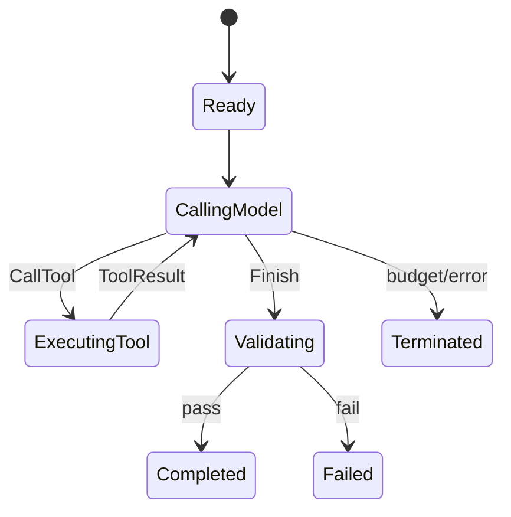

# 第 5 章：第一个 Agent Loop

**状态：设计骨架/尚未实现。** 本章冻结 M3 的问题、代码增量和验证场景；当前 P0 的确定性 Runner 只作为参考切片。

第 4 章的 `one_step` 很诚实：第一次模型调用提出工具，Runtime 执行一次，第二次模型调用给出文本。它也留下了一个明显问题：如果第二次响应又提出工具，我们只能报错。模型—工具—模型还没有成为循环。

## 5.1 学习目标

完成 M3 后，读者应能解释每次迭代的输入、动作、观察和终止条件，并能用脚本化模型验证多轮工具调用、预算耗尽和未知动作失败。当前章节中的代码仍是 Python 风格伪代码。

## 5.2 从手动两次调用到循环

最直接的改法是把固定的两次调用改成 `loop`：

```text
while budget remains:
  input = build_context(history)
  action = model.next_action(input)
  if action is Finish: validate and stop
  if action is CallTool: policy → execute → append result
stop with BudgetExhausted
```

这里的关键不是 `while` 关键字，而是每次迭代都必须有明确的输入、动作、观察和下一步条件。工具失败也是观察，不应被异常直接吞掉。

```rust
loop {
    let input = context.build(&request, &events, &limits)?;
    let action = model.next_action(input)?;
    match action {
        ModelAction::CallTool(call) => {
            policy.check(&call)?;
            let result = tools.execute(call)?;
            events.push(Event::ToolFinished(result));
        }
        ModelAction::Finish { output } => return validate(output, events),
    }
}
```

这段代码仍是教学草稿。当前 P0 的 `DeterministicRunner` 已经把类似顺序固定为 `context → model → policy → tool → validation → outcome`，但它是确定性 walking skeleton，不是通用生产循环。

## 5.3 预算和停止原因

没有预算的循环，在模型持续提出相同工具时永远不会结束。至少需要步数和工具调用数两个边界；还可以加入 token、时间和成本预算。停止原因不能只写在日志里，而应成为结果的一部分：`Completed`、`Failed`、`BudgetExhausted`、`PolicyDenied`、`Cancelled`。

P0 的状态机把 policy denial 作为终止结果，把工具失败作为结构化 `ToolResult`。这两个选择很适合教学，因为它们不会隐藏重试。后续更丰富的 recovery 会显式新增一次调用，而不是让 Runner 在内部偷偷重跑。

## 5.4 状态草图



`Finish` 不是成功本身。它只表示模型声明“我想结束”，Harness 仍要经过验证。

## 5.5 代码增量与验证

用 `ScriptedMockModel` 写三个动作最容易观察循环：工具调用、再次工具调用、最终 `Finish`。测试应断言调用顺序、工具结果进入下一轮、超过 `max_steps` 后没有第四轮。不要用真实 Provider 证明循环；P0 fixtures 的 `max_steps_exceeded` 正好提供了确定性边界。

当前 P0 参考组合：

```text
Request → SimpleContextBuilder → ScriptedMockModel
       → AllowListPolicy → ToolRegistry → Validator → EventLog
```

验证场景：脚本化模型依次提出工具、再次提出工具、最后 Finish；断言工具结果进入下一轮，超过 `max_steps` 后没有第四轮，未知动作产生明确终止结果。不要用真实 Provider 证明循环。

## 5.6 本章将得到什么

完成 M3 实现后，系统将拥有一个有界的 Agent Loop、结构化 `StopReason` 和可测试的多轮观察；这不等于生产级恢复或无限任务能力。

下一章处理循环最容易遇到的失败：历史越积越长，模型不再可靠地看到真正重要的信息。
