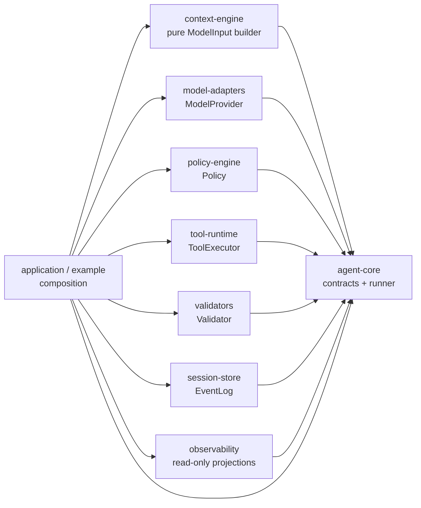
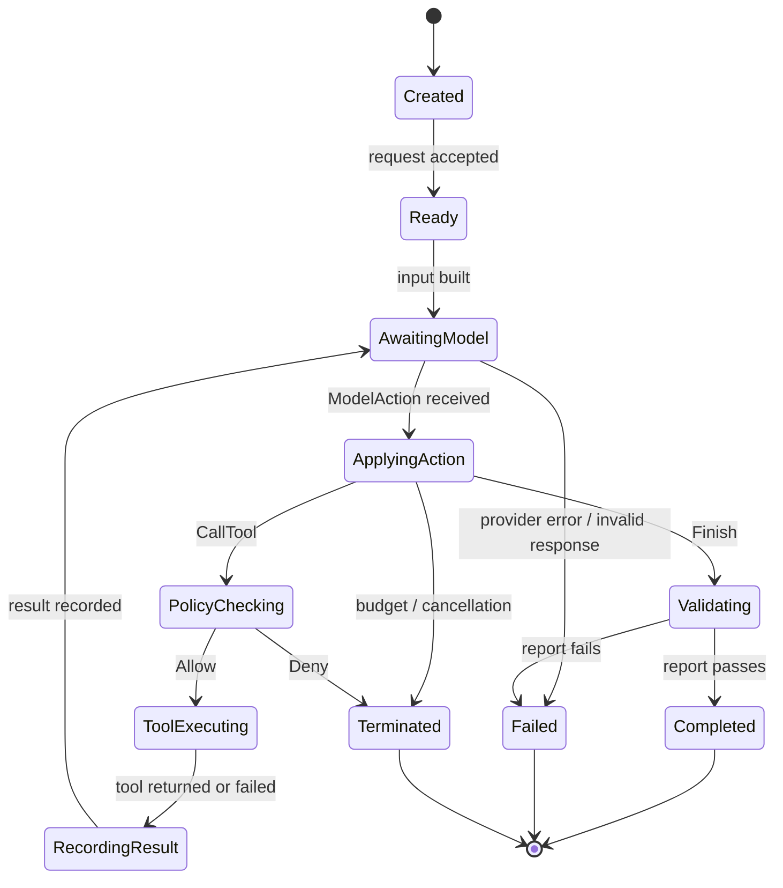

# P0 Deterministic Harness: Component Boundaries

Status: Accepted P0 boundary baseline; implementation remains experimental
Scope: The end-to-end deterministic harness slice described by the current P0 orchestration task

This document describes boundaries and ownership. The repository now contains an experimental Rust reference implementation of the deterministic slice; this document does not claim production completeness or API stability.

## 1. Scope authority and the P0 conflict

The accepted repository baseline describes the early P0 work as governance plus M0 model-call work, and places Tool Runtime, Agent Loop, Sessions, Policy, and Validation in later milestones. The current orchestration task explicitly asks P0 to freeze the contracts for an end-to-end deterministic harness containing those boundaries.

For P0-B, the current task is therefore treated as the local scope authority: this document defines the smallest contract surface that later P0 implementation agents may consume. The baseline decision remains unchanged. The scope assumption is recorded separately in [`ADR-0001`](../adr/0001-p0-end-to-end-deterministic-harness-scope.md); no accepted baseline decision is silently amended here.

The expanded P0 slice is deliberately deterministic and in-process:

- model behavior is supplied by a deterministic provider or fixture;
- tools are deterministic and side-effect-free within the harness;
- policy and validation are deterministic functions of recorded inputs;
- all semantically relevant transitions are represented by an ordered event log;
- real providers, network tools, GUI tools, and durable production recovery remain out of scope.

## 2. Component responsibilities

The names below are the component boundaries used by the P0 reference crates. They remain experimental and do not imply that every broader contract or fixture scenario is implemented.

| Component | Owns | May depend on | Must not own or depend on |
| --- | --- | --- | --- |
| `agent-core` | `RunId`, `SessionId`, `EventId`, `AgentRequest`, `AgentState`, `AgentEvent`, `ModelInput`, `ModelAction`, loop policy, termination, `RunOutcome`, `AgentError`, and boundary traits | Standard library and the contract types it defines | Provider SDKs, concrete tools, Forge Studio types, storage implementations |
| `context-engine` | Pure construction and bounded reduction of `ModelInput` from request plus prior events | `agent-core` contract types | Model calls, tool execution, policy decisions, persistence |
| `model-adapters` | Implementations of the model boundary, including scripted/mock providers for P0 | `agent-core`; optional provider-specific code outside the deterministic default path | Tool execution, policy decisions, event-log mutation |
| `policy-engine` | Deterministic authorization of a proposed `ToolCall` | `agent-core` policy inputs and state views | Running tools, changing agent state, model calls |
| `tool-runtime` | Tool registry, argument decoding, deterministic execution, and `ToolResult` production | `agent-core` tool contracts | Calling the model, bypassing policy, emitting a successful result without execution |
| `validators` | Deterministic checks over the completed run and its recorded evidence | `agent-core` events and outcome types | Re-running tools, changing the run, consulting live network state |
| `session-store` | Append/read/replay of ordered events and session/run lookup | `agent-core` event types | Deciding policy, executing tools, producing model actions |
| `observability` | Read-only projections of events, evidence, and outcomes | `agent-core` event types | Driving the loop, changing event payloads, becoming the source of truth |
| application/example composition | Wiring one implementation of each boundary into a runner | All selected component contracts | Adding Forge Studio or product-specific domain types to core |

`agent-core` is the only owner of the orchestration state machine. Other components return values to the runner; they do not advance the run themselves.

## 3. Dependency direction

The arrows below mean “implements or consumes the boundary defined by,” not “may call every API in.”



The graph has one-way ownership rules:

1. A boundary implementation may depend on core value types and traits, but core does not depend on that implementation.
2. `ToolExecutor` is reachable only through the runner after `PolicyDecision::Allow`.
3. `EventLog` receives events from the runner; it never invents semantic events or state transitions.
4. `observability` can subscribe to the same events as the log, but cannot mutate or veto a run.
5. No path may introduce a dependency from `agent-core` to Forge Studio, Godot, a provider SDK, or a concrete persistence service.

## 4. State machine ownership

`AgentState` is the authoritative state of one `RunId`. It is derived by the runner from the request and the ordered events. A consumer must not infer state from logs, metrics, or model text.



The state machine has these non-negotiable rules:

- only `agent-core` performs transitions;
- `AwaitingModel` has exactly one model decision in flight;
- `ApplyingAction` accepts exactly one validated `ModelAction`;
- a `CallTool` cannot enter `ToolExecuting` without a recorded allow decision;
- `ToolExecuting` always reaches `RecordingResult` in the normal deterministic profile, including a tool failure;
- `Completed`, `Failed`, and `Terminated` are terminal and cannot emit another model or tool action;
- a `Finish` action is not success by itself: validation must produce the final `ValidationReport` before `Completed`;
- a missing action, malformed action, exhausted budget, policy denial, cancellation, provider failure, tool failure, and failed validation must all terminate explicitly rather than falling through to another loop iteration.

### 4.1 Explicit loop termination

The runner terminates when the first applicable condition is reached:

1. `Finish` is received and validation passes: `Completed`.
2. `Finish` is received and validation fails: `Failed` with the validation failure represented in the outcome and evidence.
3. A policy check returns `Deny`: `Terminated` with a policy-denied outcome; the tool is not run.
4. The model provider, action decoder, context builder, tool runtime, or validator returns an error: `Failed`.
5. The configured step/tool/token budget is exhausted before another action can be accepted: `Terminated` with a budget outcome.
6. Cancellation is observed at a boundary: `Terminated` with a cancellation outcome.

There is no implicit “continue” action. A model must either propose one tool call or finish. If a later implementation adds batching or retries, it must add a new contract decision rather than reinterpret this P0 loop.

## 5. Tool lifecycle boundary

`ToolCall.call_id` identifies one proposed invocation. A call follows this lifecycle:

```text
ModelAction::CallTool
  → PolicyDecision recorded
  → ToolStarted recorded
  → ToolExecutor executes exactly once
  → ToolFinished(ToolResult) recorded
  → ModelInput rebuilt with the result
```

Required ordering and ownership:

- the policy decision is recorded before execution;
- `ToolStarted` is recorded before the executor is invoked;
- `ToolFinished` is recorded after the executor returns, whether the result is success or failure;
- a denied call has no `ToolStarted` or `ToolFinished` event;
- a `call_id` cannot be reused in the same run;
- the runtime must not retry invisibly; a retry is a new call with a new `call_id` and a new policy decision;
- the model sees the structured `ToolResult`, not an exception that bypasses the event log.

The P0 deterministic profile permits only tools whose result is a deterministic function of the call and the harness state visible to the call. External side effects and exactly-once compensation are not part of this contract.

## 6. Replay and evidence boundary

The event log is the semantic source for replay. A replay consumer may reconstruct state and validation inputs without invoking a model, tool, policy, or validator implementation.

`EvidenceRecord` attaches a claim or check result to the event IDs that support it. Evidence is additive: it may explain a run, but it cannot rewrite an event or change the outcome after the runner has emitted the terminal event.

The minimum replay invariants are:

- every event belongs to exactly one `RunId` and `SessionId`;
- sequence numbers are strictly increasing within a run, with no duplicate sequence;
- `EventId` is unique within a session and is deterministically generated in the P0 profile;
- an event's payload is immutable after append;
- `ToolStarted(call_id)` has exactly one later `ToolFinished(call_id)` in a complete run;
- a denied call has no tool execution events;
- a terminal outcome is the final semantic event for the run;
- replaying a complete log produces the same `AgentState`, `ValidationReport`, `EvidenceRecord` set, and `RunOutcome` as the original run;
- replay never executes a tool or calls a model;
- a truncated or structurally inconsistent log is rejected as an `AgentError::ReplayMismatch`, not silently repaired.

Wall-clock timestamps, process IDs, memory addresses, and log formatting are not semantic replay inputs. If recorded for diagnostics, they must be treated as metadata and excluded from deterministic equality.

## 7. Non-goals for this P0 contract

- real model/provider integrations or live network calls;
- arbitrary external side effects, OS process control, filesystem mutation, or GUI automation;
- human approval workflows, interactive policy prompts, or distributed workers;
- durable database schema, cross-process locking, crash-safe exactly-once side effects, or production session recovery;
- streaming model responses or streaming tool output;
- parallel tool calls, speculative execution, hidden retries, or multi-agent delegation;
- Forge Studio, Godot, Artifact Graph, SceneOperations, or any product-specific domain model;
- stable semver guarantees before the repository's stated API-stability milestone.

## 8. Unresolved questions

These questions are intentionally left for the Lead/integration gate rather than hidden in an implementation:

1. Should `SessionId` permit multiple `RunId` attempts in P0, or should that be reserved for the Sessions & Recovery milestone?
2. What canonical JSON representation and hash algorithm, if any, should be used for event and evidence fingerprints?
3. Does a failed validation produce `Failed` or a distinct terminal `Rejected` state once validators become richer?
4. Which minimal deterministic tool fixture is the canonical end-to-end example?
5. Should context truncation be a hard `AgentError` or an explicit terminal budget outcome?
6. What durable storage format should be chosen after the in-memory event-log contract is validated?

Until resolved, later agents must use the signatures and invariants in the companion contract specification and must not introduce answers by implementation accident.
